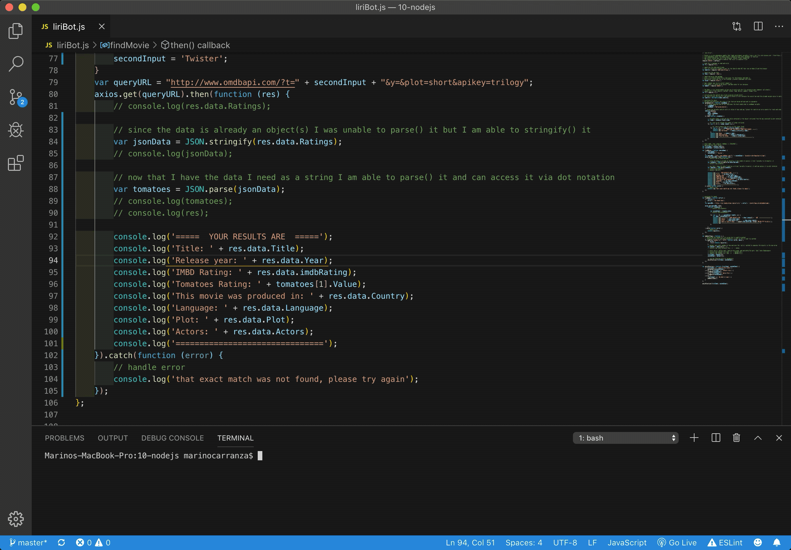
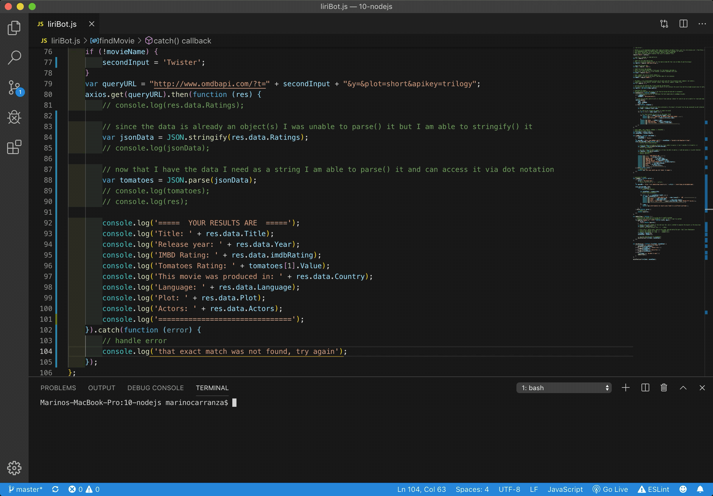

# **like-siri**

## Interacting with apis

1.  This app interacts with three different apis to retrieve either songs, movies or concerts/performances the user is interested in.

2.  This app helps the user find out where and when artists/bands are performing and provides relevant information about movies/songs the user might want to find more about.

3.  This is a user driven app, to obtain results the user needs to input the name of a movie, artist, song or band for the app to retrieve the requested information.

4.  I am the only one mantaining this app at the moment; if you would like more information you can contact me at marino.carranza@gmail.com.

Please scroll down to see a few examples of how this app works;  Thanks!

## **Search**
The user can look for a movie or group, by typing in the terminal *node* followed by either
 'movie-this' or 'concert-this' (depending on the user's choice), followed by the name of what the user is looking for.

# **Looking for a song**
The user can look for a song, by typing in the terminal *node* followed by either *spotify-this-song* followed by *name of the song to search*

# **Looking for a concert/artist**
To search for a band or artist you type *concert-this* instead.

# **Looking for a movie**

## **Roadmap**
I have started a wireframe to proceed with a front end, I will probably look into adding a link to something like ticketmaster so a user is able not only to retrieve information but can purchase tickets as well.

## **Acknowledments**
This app was created by me following class examples and research of my own.
I would like to show my appreciation to those who guided me in the process, thanks Catherine Pham, Trae Shanks and Arron Linton.

## **Contributing**
I am the only one contributing to this app at the moment, if you find this app helpful to you in any way feel free to fork it or clone; if you would like to contribute to it feel free to do it, I just ask you to let me know in advance.
marino.carranza@gmail.com

